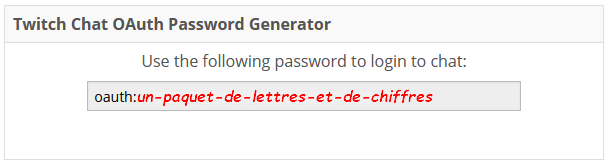
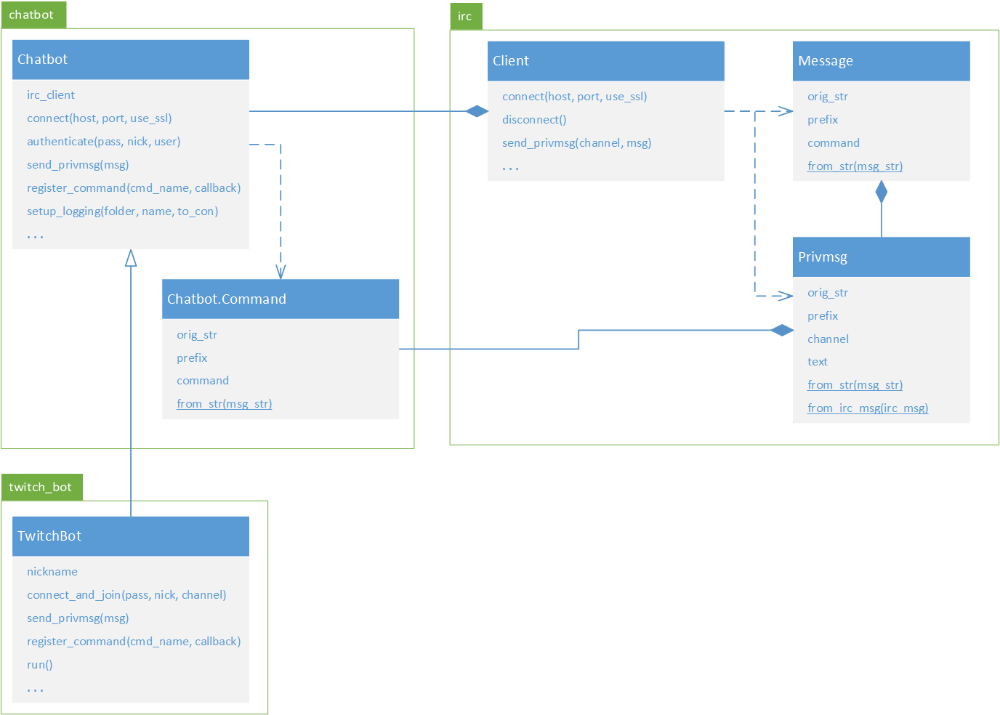

[](https://gitpod-redirect-0.herokuapp.com/)

# Chatbot pour Twitch! (révision)

<!-- Avant de commencer. Consulter les instructions à suivre dans [instructions.md](instructions.md) -->

Nous allons écrire un chatbot, c'est-à-dire un programme qui lit le texte dans le clavardage d'un stream Twitch et qui répond à des commandes en utilisant un compte Twitch.

## Avant tout, il faut un compte pour le chatbot

Les sessions de clavardage associées aux streams de Twitch utilisent le protocole IRC (*Internet Relay Chat*) pour communiquer. C'est un vieux protocole (début années 90) très populaire et utilisé pour beaucoup de choses. Pour que votre chatbot puisse se connecter au IRC de Twitch, il lui faut un compte Twitch valide avec lequel se connecter. Vous ne pouvez pas simplement entrer votre nom d'utilisateur et votre mot de passe, il vous faut un jeton d'identification. Ce jeton vous sert essentiellement de mot de passe pour vous connecter au IRC, mais sans réellement utiliser votre mot de passe.

Vous pouvez utiliser votre propre compte pour le chatbot, ce qui fait que celui-ci va parler pour vous dans le *chat*. Pour générer facilement un jeton, connectez-vous à votre compte Twitch dans votre fureteur puis allez sur https://twitchapps.com/tmi/. On vous demandera la première fois de connecter l'application de génération de jetons à votre compte (vous approuvez), puis on vous donnera un jeton sous la forme `oauth:séquence-de-lettres-et-de-chiffres`.



C'est ce jeton (incluant le `oauth:`) que vous utilisez comme mot de passe IRC. Écrivez-le en quelque part et ayez-le à portée de main pour faire les exercices.

## Présentation du code fourni



### *irc.py*

Ce fichier contient des classes qui implémentent un client IRC. Vous n'avez pas besoin de vous en servir directement pour aujourd'hui. la Classe `irc.Client` est utilisée par les autres modules pour faire la connection au serveur puis l'envoi et la réception des messages IRC.

### *chatbot.py*

Cette classe représente la base d'un chatbot IRC générique (pas forcément Twitch) qui permet de reconnaître des commandes (messages qui commencent par un certain caractère donné) et d'y associer des fonctions de rappel (*callback*). Vous n'avez pas à vous servir directement de la classe `Chatbot`, mais vous aurez à appeler certaines de ses méthodes à travers l'héritage de la classe `TwitchBot`. La classe `Chatbot.Command` sera utile dans le dernier exercice.

### *twitch_bot.py*

Cette classe représente un chatbot fonctionnel spécifiquement fait pour Twitch. Il se connecte en SSL (connexion sécurisée, comme HTTPS) au serveur IRC de Twitch et reconnait les commandes précédées d'un point d'exclamation, par exemple `!hello` (la convention sur Twitch). Ce chatbot enregistre tous les messages qu'il reçoit dans un fichier et peut afficher les messages en temps réel (argument `log_to_console` de `TwitchBot.__init__()`)

On construit un `TwitchBot` en lui donnant un dossier dans lequel mettre les journaux. Chaque session (appel de `run()`) génère son propre fichier dont le nom est la date et l'heure de connexion. On se connecte au serveur en appelant `TwitchBot.connect_and_join()` à laquelle on donne le mot de passe (le jeton incluant le `oauth:`), le surnom (nom du compte Twitch à utiliser) et le nom de la chaîne (la chaîne Twitch dans laquelle clavarder). On part ensuite la réception et le traitement des command avec `TwitchBot.run()`.

Exemple:
```python
bot = TwitchBot("mes_journaux")
bot.connect_and_join(
    le_jeton_oauth,
    le_nom_du_compte_twitch,
    le_nom_du_channel
)
bot.run()
```

## Révision chapitre 7 (fonctions)

### Répondre avec une salutation

Le code qui vous est fourni dans les modules

TODO: Callbacks, fermetures lexicales and shit.

## Révision chapitre 8 (format de fichiers)

### Répondre avec une citation aléatoire

TODO: Rappel sur les fichiers INI et JSON.

TODO: Explication sur le choix aléatoire d'une citation.

## Révision chapitre 9 (bonnes pratiques)

### Passer des arguments au script

TODO: Rappel sur `argparse`

## Révision chapitre 11 (orientée-objet)

### Matière additionnelle

TODO: `dataclasses`

TODO: Décorateurs

### Créer une classe de chatbot qui met tout le reste ensemble

TODO: Utilisation attendue de la classe `TwitchBot`; Diagramme de classe de la librairie.

TODO: Donner une citation aléatoire dans une catégorie ou dans tout.

