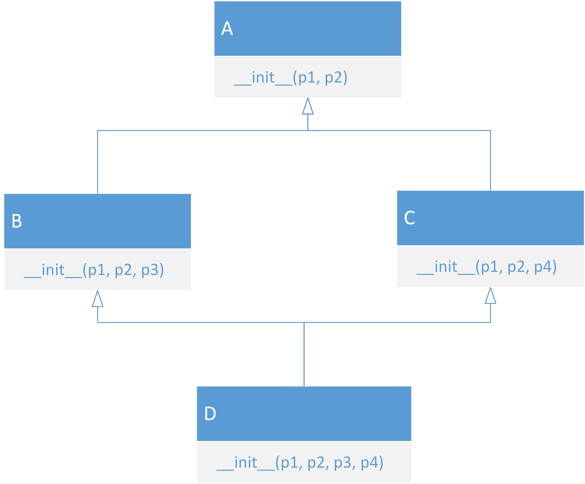
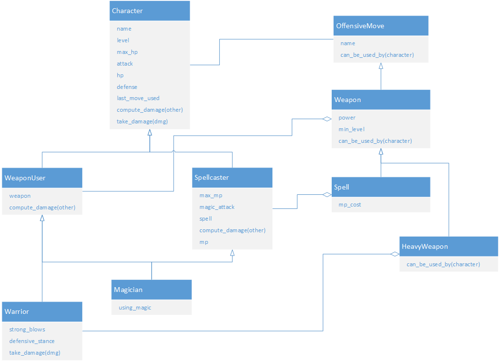
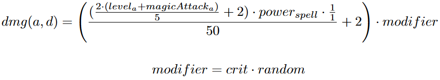

# ENCORE PLUS DE MAGIE! (chapitre 11.4)

<!-- Avant de commencer. Consulter les instructions à suivre dans [instructions.md](instructions.md) -->

Nous allons étendre le jeu que nous avons fait au chapitre 11.3 en réarrangeant les classes pour rendre le tout plus modulaire à l'aide de polymorphisme.

## Avant tout, un mot sur les classes abstraites, l'héritage multiple et le problème du losange

Comment règle-t-on le problème suivant?

Références :

[Python Course](https://www.python-course.eu/python3_multiple_inheritance.php#The-Diamond-Problem-or-the-,,deadly-diamond-of-death'') 
[Blog de Raymond Hettinger](https://rhettinger.wordpress.com/2011/05/26/super-considered-super/)

## Refonte des classes de notre jeu

## Diagramme des classes

### Classe de base `character.Character`

On va définir `Character` comme étant une classe abstraite qui possède plusieurs attributs et dont les enfants *doivent* réimplémenter la méthode virtuelle `compute_damage()`. C'est donc une classe qui ne peut pas être utilisée directement. Cette classe ne contient pas les éléments liés aux armes ou aux sorts.

On a la propriété `last_used_move` qui indique la dernière attaque utilisée par `compute_damage()`, et qui est un `OffensiveMove` (classe de base pour toutes les attaques, armes ou autres). Les classes dérivées peuvent changer le comportement de cette propriété.

On a aussi `take_damage()` qui définit comment un personnage prend du dommage. Les classes dérivées peuvent changer le comportement de cette méthode, mais n'y sont pas obligées.

La classe abstraite `OffensiveMove` a un nom et une méthode abstraite `can_be_used_by()` qui dit si un personnage passé en paramètre peut se servir de l'attaque.

## Utilisateurs d'armes et de magies

### `Weapon` et `WeaponUser`

On veut une classe qui représente une arme (puissance et niveau minimal) et une classe de personnage qui utilise des armes physiques en combat. Même logique que la dernière fois pour l'affectation

### `Spell` et `Spellcaster`

On veut une classe qui représente un sort (puissance, niveau minimal et coût en MP) et une classe de personnage qui utilise des sorts en consommant des MP.

### `Magician`

Dans notre jeu, un magicien est un personnage qui peut utiliser de la magie ou des armes. On a donc tout ce qui est dans `Spellcaster` et dans `WeaponUser`. La seule mécanique qui s'ajoute par-dessus est le choix d'utiliser de la magie ou une arme. On utilise la même logique pour le choix que dans le chapitre 11.3.

### Formules

On se rappelle des formules pour calculer le dommage physique (utilisée par `WeaponUser`) :

Où *a* est l'attaquant et *d* est le défendeur.  
*crit* est 2 environ 1/16 (6.25%) du temps, 1 sinon  
*random* est un nombre aléatoire entre 85% et 100%

Si le personnage utilise sa magie (`Spellcaster`), la formule est :

Où *a* est l'attaquant et *d* est le défendeur.  
*crit* est 2 environ 1/8 (12.5%) du temps, 1 sinon  
*random* est un nombre aléatoire entre 85% et 100%
