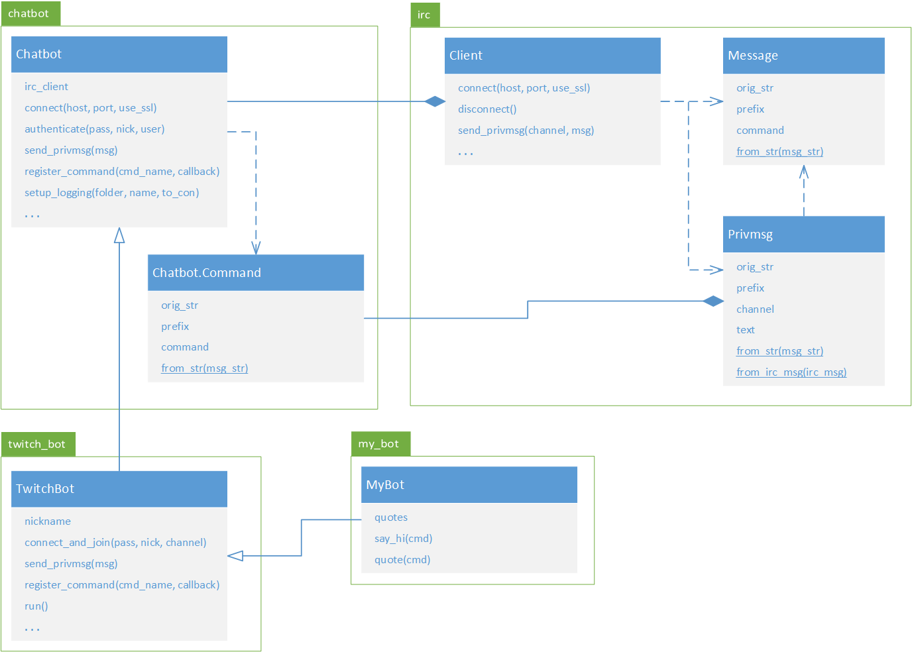
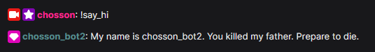
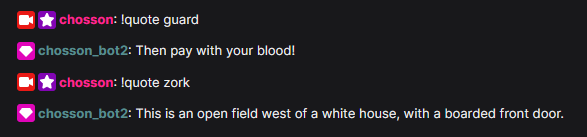

[](https://gitpod-redirect-0.herokuapp.com/)

# Chatbot pour Twitch! (révision)

<!-- Avant de commencer. Consulter les instructions à suivre dans [instructions.md](instructions.md) -->

Nous allons écrire un chatbot, c'est-à-dire un programme qui lit le texte dans le clavardage d'un stream Twitch et qui répond à des commandes en utilisant un compte Twitch.

## Avant tout, il faut un compte pour le chatbot

Les sessions de clavardage associées aux streams de Twitch utilisent le protocole IRC (*Internet Relay Chat*) pour communiquer. C'est un vieux protocole (début années 90) très populaire et utilisé pour beaucoup de choses. Pour que votre chatbot puisse se connecter au IRC de Twitch, il lui faut un compte Twitch valide avec lequel se connecter. Vous ne pouvez pas simplement entrer votre nom d'utilisateur et votre mot de passe, il vous faut un jeton d'identification. Ce jeton vous sert essentiellement de mot de passe pour vous connecter au IRC, mais sans réellement utiliser votre mot de passe.

Vous pouvez utiliser votre propre compte pour le chatbot, ce qui fait que celui-ci va parler pour vous dans le *chat*. Pour générer facilement un jeton, connectez-vous à votre compte Twitch dans votre fureteur puis allez sur https://twitchapps.com/tmi/. On vous demandera la première fois de connecter l'application de génération de jetons à votre compte (vous approuvez), puis on vous donnera un jeton sous la forme `oauth:séquence-de-lettres-et-de-chiffres`.


C'est ce jeton (incluant le `oauth:`) que vous utilisez comme mot de passe IRC. Écrivez-le quelque part et ayez-le à portée de main pour faire les exercices.

## Présentation du code fourni



### *irc.py*

Ce fichier contient des classes qui implémentent un client IRC. Vous n'avez pas besoin de vous en servir directement pour aujourd'hui. La classe `irc.Client` est utilisée par les autres modules pour faire la connexion au serveur puis l'envoi et la réception des messages IRC.

### *chatbot.py*

Cette classe représente la base d'un chatbot IRC générique (pas forcement Twitch) qui permet de reconnaître des commandes (messages qui commencent par un certain caractère donné) et d'y associer des fonctions de rappel (*callback*). Vous n'avez pas à vous servir directement de la classe `Chatbot`, mais vous aurez à appeler certaines de ses méthodes à travers l'héritage de la classe `TwitchBot`. La classe `Chatbot.Command` sera utile dans le dernier exercice.

### *twitch_bot.py*

Cette classe représente un chatbot fonctionnel spécifiquement fait pour Twitch. Il se connecte en SSL (connexion sécurisée, comme HTTPS) au serveur IRC de Twitch et reconnait les commandes précédées d'un point d'exclamation, par exemple `!hello` (la convention sur Twitch). Ce chatbot enregistre tous les messages qu'il reçoit dans un fichier et peut afficher les messages en temps réel (argument `log_to_console` de `TwitchBot.__init__()`)

On construit un `TwitchBot` en lui donnant un dossier dans lequel mettre les journaux. Chaque session (appel de `run()`) génère son propre fichier dont le nom est la date et l'heure de connexion. On se connecte au serveur en appelant `TwitchBot.connect_and_join()` à laquelle on donne le mot de passe (le jeton incluant le `oauth:`), le surnom (nom du compte Twitch à utiliser) et le nom de la chaîne (la chaîne Twitch dans laquelle clavarder). On part ensuite la réception et le traitement des command avec `TwitchBot.run()`.

Exemple:
```python
bot = TwitchBot("mes_journaux")
bot.register_command(
    "ma_commande",
    mon_callback
)
bot.connect_and_join(
    le_jeton_oauth,
    le_nom_du_compte_twitch,
    le_nom_du_channel
)
bot.run()
```

## Révision chapitre 7 (fonctions)

### Répondre avec une salutation

On veut que le chatbot réponde à la commande `!say_hi` avec un certain message. Il faut donc envoyer un message au serveur. La méthode `send_privmsg()` de `TwitchBot` permet de faire cela. Pour que la commande soie reconnue, il faut l'enregistrer avec `TwitchBot.register_command()`, à laquelle on passe le nom de la commande (sans le `!`) et un callback qui doit prendre un seul paramètre qui est le message qui l'a déclenché. On ne va pas se servir du paramètre pour tout de suite.

Il nous faut donc créer une fonction de rappel qui envoie un message dans le chat à l'aide du bot connecté. Toutefois, on ne veut pas *hardcoder* le bot et le message directement dans la fonction. On va plutôt faire une fonction qui crée le callback à en lui passant le bot et le message. Le callback retourné est ensuite enregistré avec `register_command()`.

On vous dit d'insérer votre jeton OAuth, votre nom de compte et le channel cible (le chatroom dans lequel votre chatbot va parler). C'est évidemment *chosson* pour aujourd'hui si vous voulez que votre bot soit visible à la classe. Vous pouvez aussi faire les tests sur votre propre chaine pour ne pas polluer le chatroom du cours. En dehors du cours, faites vos tests sur votre propre chaine et ne spammez pas mon chat avec vos chatbot SVP.

Le code à compléter est dans *ch7.py*

## Révision chapitre 8 (format de fichiers)

Nous avons vu au chapitre 8 plusieurs formats de fichier, tels que WAV, INI, CSV et JSON.

### Charger les données de connexion d'un fichier INI

Dans l'exercice précédent, nous avons écrit directement dans le code source le nom du compte, le jeton d'identification et le channel auquel se connecter. Ce n'est clairement pas une bonne pratique. Nous allons plus charger ces données à partir d'un fichier INI ([data/config.ini](data/config.ini)). Il vous faut donc aller mettre votre nom de compte et votre jeton dans le fichier (sous la section `[login]`). Le nom du channel auquel se connecter est dans la section `[chat]`.

Le code à compléter est dans *ch8.py*

### Répondre avec une citation aléatoire

Dans le fichier [data/quotes.json](data/quotes.json) on a quelques citations de jeux vidéos, catégorisées selon le jeu ou le contexte. On voudrait avoir une commande `!quote` qui retourne une citation aléatoire dans celles présentes dans le fichier. On charge d'abord le fichier JSON (fonction `load_quotes()`). Ensuite, dans `build_quotes_callback()` on crée un callback qui choisit aléatoirement une catégorie, puis une citation aléatoire dans cette catégorie. Notez comment le fichier est construit, c'est-à-dire un dictionnaire dont chaque clé est une catégorie (le nom d'un jeu) et la valeur est une liste de citations.

## Révision chapitre 9 (bonnes pratiques)

### Passer des arguments au script

Dans l'exercice précédent, nous avions chargé les données à partir de fichiers, mais les noms des fichiers étaient encore écrits directement dans le code source. On peut faire mieux. En effet, nous avons vu au chapitre 9 comment passer des arguments au script quand on l'appelle. On va donc passer les noms des fichiers en paramètres au script. De cette façon, on pourrait rouler le script ainsi :

```
./main.py --config-file data/config.ini --quotes-file data/quotes.json
```

On roule le même code qu'au chapitre 8 (en utilisant `run_ch8_example()`) en passant les noms de fichier extraits de la ligne de commande.

Le code à compléter est dans *ch9.py*

Documentation de `argparse` : https://docs.python.org/3/library/argparse.html#the-add-argument-method

## Révision chapitre 11 (orientée-objet)

### Matière additionnelle

Les classes fournies utilisent des notions qu'on n'a pas encore vues dans le cours, particulièrement les *dataclasses* et les décorateurs.

#### Décorateurs (très optionel)

On s'est déjà servi de décorateurs jusqu'à présent, tels que `@property`, `@staticmethod` et `@abstractmethod`, mais nous n'avons jamais compris comment ils fonctionnent. Nous n'allons pas en faire dans l'exercice qui suit non plus, mais si vous voulez comprendre comment est implémenté le décorateur `@TwitchBot.new_command`, vous aurez besoin des bases.

Vous trouverez sur [realpython.com](https://realpython.com/) un excellent [tutoriel sur les décorateurs](https://realpython.com/primer-on-python-decorators/). Vous n'en avez pas besoin pour le cours INF1007, mais ça peut approfondir votre maîtrise du Python si vous êtes curieux. C'est en gros nos chapitres 7 et 11 sur stéroïdes.

#### Dataclasses

Il nous arrive parfois de vouloir écrire une classe simple qui ne fait que contenir des valeurs accessibles publiquement, chacune ayant un type précis et sans avoir besoin de méthodes d'accès et de modification particulières. Pour ce faire, il faut quand même écrire un `__init__()` qui initialise les attributs qu'on veut et un `__repr__()` qui est somme toute assez trivial (on formate les données une à la suite de l'autre). Ça fait beaucoup de code qui ne sert pas à grand-chose, ou du *boilerplate* comme on dit.

Une addition relativement récente au Python (dans 3.7) est l'introduction des *data classes* (module `dataclasses`). Une *data class* est une classe contenant principalement des données (quoiqu'elle peut avoir des méthodes aussi). On la crée à l'aide du décorateur `@dataclass` comme suit :

```python
from dataclasses import dataclass

@dataclass
class InventoryItem:
    nickname: str
    unit_price: float
    available_qty: int = 0

parrots = InventoryItem("Parrot", 420.69)
eggs = InventoryItem("Egg x12", 3.99, 42)
parrots.available_qty += 1
print(parrots)
print(eggs)
```

Encore une fois, [realpython.com](https://realpython.com/) a un [guide sur les *data classes*](https://realpython.com/python-data-classes/) assez complet que vous pouvez consulter pour plus de détails.

### Créer une classe de chatbot qui met tout le reste ensemble

Malgré nos efforts, notre code de chatbot est assez peu élégant (des callbacks en fermetures lexicales enregistrés manuellement). La classe fournie `TwitchBot`, dont on s'est servie directement jusqu'à présent, est en fait écrite pour être utilisée en héritage. On va donc en hériter dans une classe `MyBot` (fichier *my_bot.py*) et utiliser le décorateur `TwitchBot.new_command` pour enregistrer des commandes. Un exemple est donné dans la *docstring* de `TwitchBot`. Ensuite, on va utilser cette classe au lieu de `TwitchBot` pour construire notre bot dans *ch11.py*.

#### My name is...

On enregistre une commande `!say_hi` à laquelle le bot répond en insérant son nom dans une certaine ligne de dialogue :



Dans cet exemple, le bot utilise le compte *chosson_bot2* pour communiquer.

#### You are likely to be eaten...

On enregistre une commande `!quote` à laquelle le bot répond en choisissant une citation aléatoire dans celles chargées du JSON (comme dans les exemples précédents). Toutefois, on peut choisir la catégorie d'où provient la citation. Si on n'en fournit pas, une catégorie au hasard est choisie (même comportement que les exemples précédents).



